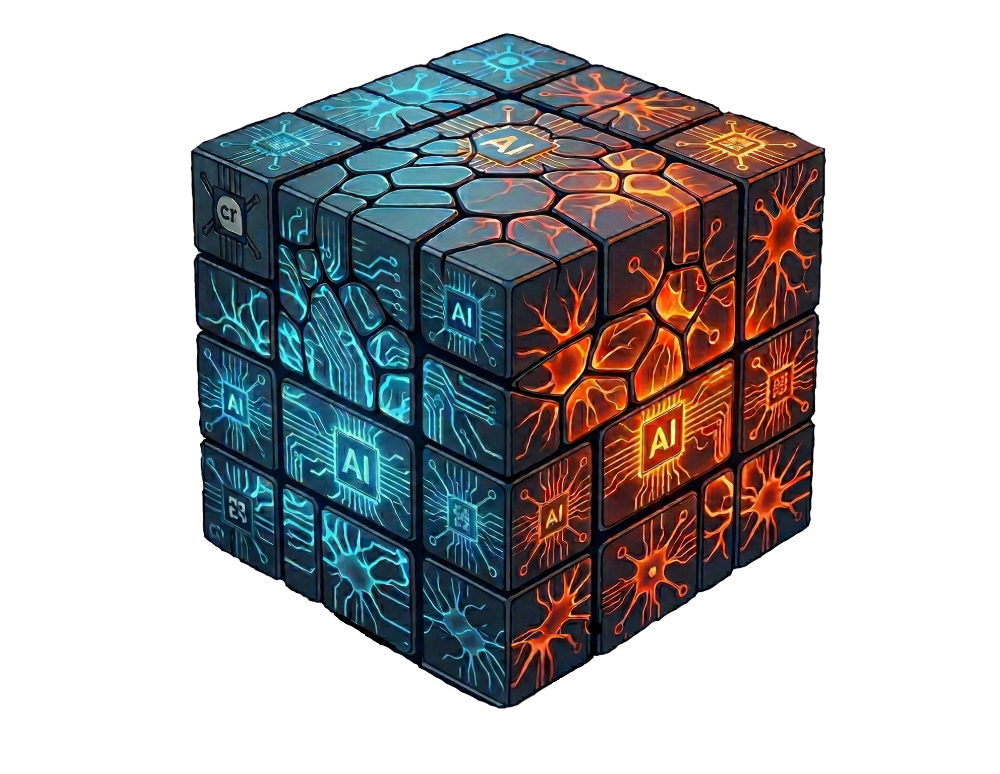

<p align="center">
  
</p>

<h1 align="center">NeuroBrix</h1>

<p align="center">
  <strong>Universal Deep Learning Inference Engine</strong><br/>
  One engine. Any model. Any modality. Zero model-specific code.
</p>

<p align="center">
  <a href="https://pypi.org/project/neurobrix/"></a>
  <a href="https://pypi.org/project/neurobrix/"></a>
  <a href="./LICENSE"></a>
  <a href="https://github.com/NeuroBrix/neurobrix"></a>
  <a href="https://gitlab.com/neurobrix/neurobrix"></a>
  <a href="https://neurobrix.es/models"></a>
</p>

<p align="center">
  <a href="https://neurobrix.es/models">Hub</a> &nbsp;|&nbsp;
  <a href="https://neurobrix.es/docs">Docs</a> &nbsp;|&nbsp;
  <a href="https://pypi.org/project/neurobrix/">PyPI</a> &nbsp;|&nbsp;
  <a href="https://github.com/NeuroBrix/neurobrix">GitHub</a> &nbsp;|&nbsp;
  <a href="https://gitlab.com/neurobrix/neurobrix">GitLab</a> &nbsp;|&nbsp;
  <a href="#roadmap">Roadmap</a> &nbsp;|&nbsp;
  <a href="./CONTRIBUTING.md">Contributing</a>
</p>

---

## The Problem

The AI inference landscape is fragmented. Every model family requires its own stack, its own pipeline code, its own deployment tooling. Want to run a diffusion model? Learn ComfyUI or write custom diffusers pipelines. Need an LLM? Pick between Ollama, vLLM, llama.cpp — each with its own limitations. Audio? Video? Start from scratch.

**NeuroBrix eliminates this fragmentation entirely.**

One engine. One CLI. One container format. Import a model, run it. The runtime doesn't know or care whether it's executing a diffusion transformer, a mixture-of-experts LLM, a speech recognizer, or a video generator. It sees tensors, graphs, and execution plans — nothing else.

---

## Why NeuroBrix?

| Capability | Ollama | llama.cpp | vLLM | ComfyUI | **NeuroBrix** |
|:-----------|:------:|:---------:|:----:|:-------:|:-------------:|
| LLMs | Yes | Yes | Yes | -- | **Yes** |
| Image generation | -- | -- | -- | Yes | **Yes** |
| Video generation | -- | -- | -- | -- | **Yes** |
| Audio (STT + TTS) | -- | -- | -- | -- | **Yes** |
| Multimodal (understand + generate) | -- | -- | -- | -- | **Yes** |
| Mixture-of-Experts | -- | -- | Yes | -- | **Yes** |
| Multi-GPU auto-allocation | -- | -- | Yes | -- | **Yes** |
| Cross-platform (Linux, Windows, macOS) | Yes | Yes | -- | -- | **Yes** |
| Universal model format | -- | GGUF (LLM only) | -- | -- | **NBX (any model)** |
| No model-specific code | -- | -- | -- | -- | **Yes** |

Other tools solve one piece of the puzzle. NeuroBrix solves the whole puzzle.

---

## Installation

### Step 1: Install PyTorch with CUDA

```bash
# For CUDA 12.4 (RTX 30xx, 40xx, A100, H100)
pip install torch --index-url https://download.pytorch.org/whl/cu124

# For CUDA 12.1
pip install torch --index-url https://download.pytorch.org/whl/cu121

# For CUDA 11.8 (older GPUs like V100)
pip install torch --index-url https://download.pytorch.org/whl/cu118
```

Verify CUDA is available:
```bash
python -c "import torch; print(torch.cuda.is_available())"  # Should print: True
```

### Step 2: Install NeuroBrix

```bash
pip install neurobrix
```

### Platform Support

| Platform | GPU Support | Notes |
|----------|-------------|-------|
| **Linux** | CUDA, Triton kernels | Full support, recommended for production |
| **Windows** | CUDA | Fully supported. Triton not available on Windows |
| **macOS** | Apple Silicon (MPS) | M-series GPUs via PyTorch MPS. Triton not available on macOS |

**Requirements:** Python 3.10+ / PyTorch 2.1+. NVIDIA GPU (CUDA) recommended for production; Apple Silicon (MPS) and CPU-only execution are also supported.

---

## Quick Start

```bash
# Import a model from the hub
neurobrix import Vendor/Model_Name --no-keep

# Generate an image (hardware auto-detected)
neurobrix run --model Model_Name \
    --prompt "A sunset over mountains" --steps 20

# Or serve for instant repeat inference
neurobrix serve --model Model_Name
neurobrix run --prompt "A robot painting on canvas" --output robot.png
neurobrix stop
```

### Serve Mode (Hot Run Mode — Recommended)

Loads weights into VRAM once and keeps the model warm. Every subsequent request runs with zero startup overhead.

```bash
neurobrix serve --model Model_Name

# Image generation (instant — model already loaded)
neurobrix run --prompt "A cat in a hat" --output cat.png

# LLM interactive chat
neurobrix chat --temperature 0.7

# Stop and free VRAM
neurobrix stop
```

---

## Usage by Model Family

NeuroBrix runs **9 model families** through one uniform CLI — image, video, LLM, vision-language (VLM), multimodal, text-to-speech, speech-to-text, speech understanding (audio_llm), and upscalers. Each family uses different CLI flags and defaults. Hardware is always auto-detected.

### Image Generation

```bash
neurobrix run --model Sana_1600M_4Kpx_BF16 \
    --prompt "A sunset over mountains" \
    --steps 20 --cfg 5.0 --seed 42 \
    --height 1024 --width 1024 \
    --output sunset.png
```

| Flag | Description | Default |
|------|-------------|---------|
| `--prompt` | Text description of the image to generate | Required |
| `--steps` | Number of diffusion steps (more = higher quality, slower) | Model-dependent (20-50) |
| `--cfg` | Classifier-free guidance scale (higher = closer to prompt) | Model-dependent (4.5-7.5) |
| `--height` / `--width` | Output resolution in pixels | Model-dependent (1024-4096) |
| `--seed` | Random seed for reproducible results | Random |
| `--output` | Output file path | `output.png` |

### Large Language Models

```bash
# Single-shot
neurobrix run --model deepseek-moe-16b-chat \
    --prompt "Explain quantum computing in simple terms" \
    --temperature 0.7 --max-tokens 512 \
    --output response.txt

# Interactive chat (requires serve mode)
neurobrix serve --model deepseek-moe-16b-chat
neurobrix chat --temperature 0.7
neurobrix stop
```

| Flag | Description | Default |
|------|-------------|---------|
| `--prompt` | Input text or question | Required |
| `--temperature` | Sampling randomness (0 = deterministic, 1 = creative) | Model-dependent (0.6-1.0) |
| `--max-tokens` | Maximum tokens to generate | Model-dependent (512-32768) |
| `--repetition-penalty` | Penalize repeated tokens (1.0 = off) | 1.0 |
| `--output` | Save response to file | stdout |

### Vision-Language & Multimodal

Vision-language models answer questions about an image. Multimodal models (Janus-Pro) have two heads — text understanding and image generation — selected with `--mode` (required for this family).

```bash
# VLM: describe an image
neurobrix run --model <vlm-model> \
    --input-image cat.jpg \
    --prompt "What animal is in this image?"

# Multimodal — image generation head
neurobrix run --model Janus-Pro-7B \
    --mode image --prompt "a red cat sitting on a couch"

# Multimodal — text understanding head
neurobrix run --model Janus-Pro-7B \
    --mode text --input-image cat.jpg --prompt "describe this image"
```

### Audio — Speech-to-Text (STT)

```bash
neurobrix run --model whisper-large --audio recording.wav
```

| Flag | Description | Default |
|------|-------------|---------|
| `--audio` | Path to audio file (WAV, FLAC, MP3) | Required |
| `--output` | Save transcription to file | stdout |

> **Note:** STT models use `--audio`, not `--prompt`. Temperature defaults to 0.0 (greedy decoding) for accurate transcription.

### Audio — Text-to-Speech (TTS)

```bash
neurobrix run --model Kokoro-82M \
    --prompt "Hello, welcome to NeuroBrix!" \
    --output speech.wav
```

| Flag | Description | Default |
|------|-------------|---------|
| `--prompt` | Text to synthesize into speech | Required |
| `--temperature` | Sampling variation (lower = more consistent) | Model-dependent (0.6) |
| `--output` | Output audio file path | `output.wav` |

### Audio — Speech Understanding (audio_llm)

Audio-conditioned LLMs take **both** an audio file and a text instruction — they answer questions or transcribe-on-demand, not blind transcription.

```bash
neurobrix run --model Voxtral-Mini-3B-2507 \
    --audio meeting.wav \
    --prompt "Transcribe this audio." \
    --output transcript.txt
```

| Flag | Description | Default |
|------|-------------|---------|
| `--audio` | Path to audio file | Required |
| `--prompt` | Instruction (e.g. "Transcribe this audio.", "Summarize the call.") | Required |
| `--output` | Save the text answer to file | stdout |

> **STT vs audio_llm:** plain STT models (Whisper, Parakeet) need only `--audio`. audio_llm models (Voxtral, Canary-Qwen, Granite-Speech) need `--audio` **and** `--prompt`.

### Image Upscaling (Super-Resolution)

Upscalers take an input image and emit a higher-resolution one (the scale factor is per-model). Use the dedicated `upscale` command, which also exposes `--mode` directly:

```bash
neurobrix upscale --model hat-l-x4 \
    --input photo.png --output photo_4x.png \
    --mode compiled
```

| Flag | Description | Default |
|------|-------------|---------|
| `--model` | Upscaler model name (e.g. `hat-l-x4`, `real-esrgan-x4`, `swinir-classical-x4`) | Required |
| `--input` | Input image path (PNG/JPEG) | Required |
| `--output` | Output image path (PNG) | Required |
| `--mode` | Execution mode: `compiled` / `sequential` / `triton` / `triton-sequential` | `compiled` |

> Via the universal `run` command, the same models take `--input-image` instead of `--input`.

### Video Generation

The video family covers **text-to-video and image-to-video** (10 models — Wan 2.1/2.2, CogVideoX, Mochi, Open-Sora, Allegro, SANA-Video), all validated in the four execution modes. The mode is auto-deduced from the inputs: passing `--input-image` switches to image-to-video.

```bash
# Text-to-video
neurobrix run --model SANA-Video_2B_720p \
    --prompt "A cat playing piano" \
    --steps 30 --cfg 5.0 --seed 42 \
    --num-frames 81 \
    --output video.mp4

# Image-to-video (auto-detected from --input-image)
neurobrix run --model Wan2.2-I2V-A14B \
    --input-image first_frame.png \
    --prompt "camera pans left, gentle rain" \
    --num-frames 49 --seed 42 \
    --output video.mp4
```

| Flag | Description | Default |
|------|-------------|---------|
| `--prompt` | Text description of the video to generate | Required |
| `--input-image` | First frame — switches to image-to-video | — |
| `--num-frames` | Number of frames to generate | Model-dependent |
| `--fps` | Output frame rate | Model-dependent |
| `--steps` | Number of diffusion steps | Model-dependent (20-50) |
| `--cfg` | Guidance scale | Model-dependent (5.0) |
| `--seed` | Random seed (same seed → same video) | Random |
| `--output` | Output file path | `output.mp4` |

> Video models run at their **native resolution and clip length** — up to 720×1280 at 88 frames (Allegro) — with large spatio-temporal activations tiled automatically through both VAE encode and decode. The biggest models (14B+, including the 28B dual-denoiser Wan2.2-I2V-A14B) are placed across multiple GPUs automatically.

---

## Execution Modes — Two Branches, Four Modes

Every model in NeuroBrix can run through **two fully independent compute branches**, each in a **sequential** (op-by-op) and a **compiled** (fused hot-loop) variant — four modes in total. The branches share the same `.nbx` container and the same Prism placement plan, but they do **not** share compute code. They are deliberately kept as parallel paths.

| Flag | Branch | Variant | Compute substrate |
|------|--------|---------|-------------------|
| `--compiled` *(default)* | PyTorch | compiled hot-loop | `torch` + cuDNN / cuBLAS / cuFFT |
| `--sequential` | PyTorch | op-by-op | `torch` ATen, one op at a time |
| `--triton` | Triton | compiled hot-loop | NeuroBrix `@triton.jit` kernels + `NBXTensor` |
| `--triton-sequential` | Triton | op-by-op | NeuroBrix `@triton.jit` kernels, one op at a time |

If you pass no mode flag, NeuroBrix runs `--compiled`.

**The PyTorch branch** is the pragmatic bridge to the mature PyTorch + NVIDIA-library ecosystem. `--sequential` dispatches each ATen op to native PyTorch one at a time — a transparent, op-by-op reference path that is ideal for debugging. `--compiled` fuses that same graph into a zero-overhead execution sequence (pre-resolved tensor slots, direct SDPA, integer-indexed memory arena) — this is the production path.

**The Triton branch** is the NeuroBrix value-add: 100% NeuroBrix Triton kernels through `NBXTensor`, with **no `torch.*`, no cuDNN/cuBLAS** on the compute path — hardware-universal and vendor-agnostic. `--triton-sequential` runs the same kernels op-by-op for transparent debugging; `--triton` is its fused, zero-overhead form.

**Which to use:**

- **Just run a model →** the default (`--compiled`). Fastest PyTorch path.
- **Vendor-agnostic / no NVIDIA-library lock-in →** `--triton`.
- **Debugging a numerical discrepancy →** compare `--sequential` against `--triton-sequential` op-by-op.

```bash
# Same model, four ways:
neurobrix run --model Sana_1600M_1024px_MultiLing --prompt "a red fox" --output fox.png                      # compiled (default)
neurobrix run --model Sana_1600M_1024px_MultiLing --prompt "a red fox" --sequential        --output fox.png  # PyTorch op-by-op
neurobrix run --model Sana_1600M_1024px_MultiLing --prompt "a red fox" --triton            --output fox.png  # Triton compiled
neurobrix run --model Sana_1600M_1024px_MultiLing --prompt "a red fox" --triton-sequential --output fox.png  # Triton op-by-op
```

> Every supported model is validated in all four execution modes, and the modes are cross-checked for numerical agreement — they produce the same output (modulo floating-point numerics). Sampling is deterministically seeded: the same `--seed` reproduces the same output on the same hardware. The four mode flags are also available on `neurobrix serve`; `neurobrix upscale` selects the same modes via `--mode <compiled|sequential|triton|triton-sequential>`.

---

## NeuroBrix Hub & Model Management

Models are hosted on the **[NeuroBrix Hub](https://neurobrix.es/models)** and managed locally through a two-tier storage system:

- **Store** (`~/.neurobrix/store/`) — downloaded `.nbx` archives (compressed)
- **Cache** (`~/.neurobrix/cache/`) — extracted models ready for inference

### Browse & Import

```bash
# Browse the full hub catalog
neurobrix hub

# Filter by family
neurobrix hub --category IMAGE
neurobrix hub --category LLM
neurobrix hub --category AUDIO
neurobrix hub --category VIDEO

# Search by name
neurobrix hub --search sana

# Import a model (downloads .nbx → extracts to cache)
neurobrix import THUDM/CogVideoX-2b

# Import and delete the .nbx archive to save disk space
neurobrix import pixart/sigma-xl-1024 --no-keep

# Force re-import (overwrites existing)
neurobrix import Vendor/Model_Name --force
```

### List & Manage

```bash
# List installed models in cache (ready to run)
neurobrix list

# List downloaded .nbx archives in store
neurobrix list --store

# Show system info: installed models, hardware, disk usage
neurobrix info --models

# Remove a model from cache
neurobrix remove Model_Name

# Remove from both store and cache
neurobrix remove Model_Name --all

# Clean everything — free all disk space
neurobrix clean --all -y
```

### How It Works

```
neurobrix import Vendor/Model_Name --no-keep
  │
  ├─ 1. Download .nbx from neurobrix.es → ~/.neurobrix/store/
  ├─ 2. Extract to ~/.neurobrix/cache/Model_Name/
  ├─ 3. Validate manifest, components, weights
  └─ 4. Delete .nbx from store (--no-keep)

neurobrix run --model Model_Name --prompt "..."
  │
  └─ Reads directly from cache — zero extraction overhead
```

---

## Supported Models

NeuroBrix is a **runtime engine** — it executes models but does **not train or create** them. All models listed below are the work of their respective authors and are subject to their original licenses. **Users must review and accept each model's license before use.**

There are two levels of support:

- **Published on the hub** — pre-built `.nbx` containers, downloadable with `neurobrix import`. The video family is being published alongside the v0.3.0 release.
- **Validated by the engine** — models validated in all four execution modes; hub packages are being published progressively.

### Published on the Hub

#### Image Generation

| Model | Author | License | Size |
|-------|--------|---------|-----:|
| PixArt-Sigma-XL-1024 | PixArt | OpenRAIL++ | 20.3 GB |
| PixArt-XL-1024 | PixArt | OpenRAIL++ | 20.4 GB |
| Sana-1600M-MultiLing | NVIDIA | NVIDIA Open Model License | 12.1 GB |
| Sana-1600M-4Kpx-BF16 | NVIDIA | NVIDIA Open Model License | 12.1 GB |
| Flex.1-alpha | Ostris | Apache 2.0 | 24.5 GB |

#### Video Generation

| Model | Author | License | Type |
|-------|--------|---------|------|
| Wan-AI/Wan2.1-T2V-1.3B | Alibaba | Apache 2.0 | text-to-video |
| Wan-AI/Wan2.1-VACE-1.3B | Alibaba | Apache 2.0 | video creation & editing |
| Wan-AI/Wan2.1-I2V-14B-480P | Alibaba | Apache 2.0 | image-to-video |
| Wan-AI/Wan2.2-I2V-A14B | Alibaba | Apache 2.0 | image-to-video, 28B dual-denoiser |
| THUDM/CogVideoX-2b | Zhipu AI | Apache 2.0 | text-to-video |
| THUDM/CogVideoX-5b-I2V | Zhipu AI | CogVideoX License | image-to-video |
| genmo/Mochi-1-preview | Genmo | Apache 2.0 | text-to-video |
| hpcai-tech/Open-Sora-v2 | HPC-AI Tech | Apache 2.0 | text-to-video |
| rhymes-ai/Allegro | Rhymes AI | Apache 2.0 | text-to-video, native 720×1280, 88 frames |
| rhymes-ai/Allegro-TI2V | Rhymes AI | Apache 2.0 | image-to-video |
| Efficient-Large-Model/SANA-Video-2B-720p | NVIDIA | NVIDIA Open Model License | text-to-video, 720p |

#### Audio (Speech-to-Text, Speech Understanding, Text-to-Speech)

| Model | Author | License | Size | Type |
|-------|--------|---------|-----:|------|
| Whisper-Large-V3 | OpenAI | MIT | 5.8 GB | STT |
| Whisper-V3-Turbo | OpenAI | MIT | 1.5 GB | STT |
| Parakeet-TDT-1.1B | NVIDIA | CC-BY-4.0 | 4.1 GB | STT |
| Voxtral-Mini-3B | Mistral AI | Apache 2.0 | 8.7 GB | audio_llm |
| Canary-Qwen-2.5B | NVIDIA | CC-BY-4.0 | 4.8 GB | audio_llm |
| Granite-Speech-3.3-8B | IBM | Apache 2.0 | 16.1 GB | audio_llm |
| Orpheus-3B | Canopy Labs | Apache 2.0 | 14.2 GB | TTS |
| Kokoro-82M | Hexgrad | Apache 2.0 | 385 MB | TTS |
| VibeVoice-1.5B | Microsoft | MIT | 5.1 GB | TTS |
| OpenAudio-S1-Mini | Fish Audio | CC-BY-NC-SA-4.0 | 4.0 GB | TTS |
| Chatterbox | Resemble AI | MIT | 2.1 GB | TTS |

#### Image Upscalers (Super-Resolution)

| Model | Author | License | Scale |
|-------|--------|---------|------:|
| HAT-L-x4 | XPixelGroup | Apache 2.0 | 4x |
| Real-ESRGAN-x4 | Xintao Wang et al. | BSD-3-Clause | 4x |
| SwinIR-Classical-x4 | Jingyun Liang et al. | Apache 2.0 | 4x |
| Swin2SR-Classical-x4 | Marcos V. Conde et al. | Apache 2.0 | 4x |

#### Large Language Models

| Model | Author | License | Size |
|-------|--------|---------|-----:|
| DeepSeek-MoE-16B-Chat | DeepSeek | DeepSeek License | 30.6 GB |
| Qwen3-30B-A3B-Thinking | Alibaba / Qwen | Apache 2.0 | 57.1 GB |
| TinyLlama-1.1B-Chat | TinyLlama | Apache 2.0 | 2.1 GB |

### Validated by the Engine (hub publication in progress)

These models are fully supported by the runtime — validated in all four execution modes with cross-checked numerical agreement — and their pre-built `.nbx` packages are being rolled out to the hub.

| Model | Author | Type |
|-------|--------|------|
| Janus-Pro-7B | DeepSeek | multimodal (text understanding + image generation) |

> **Non-commercial:** OpenAudio S1 Mini uses CC-BY-NC-SA-4.0 — non-commercial use only. Check each model's license on the [NeuroBrix Hub](https://neurobrix.es/models) before commercial deployment.

Browse the full catalog and license details: **[neurobrix.es/models](https://neurobrix.es/models)**

---

## The NBX Format

NeuroBrix introduces `.nbx` — a **universal container format for AI models**. Where GGUF is limited to LLMs and ONNX struggles with dynamic architectures, NBX captures any computation graph with full fidelity.

```
model.nbx (self-contained archive)
  ├── manifest.json              Model metadata and component list
  ├── topology.json              Execution flow and component connections
  ├── runtime/
  │   ├── defaults.json          Generation parameters, model config
  │   └── variables.json         Runtime tensor allocation rules
  ├── components/
  │   ├── text_encoder/          Text conditioning (CLIP, T5, etc.)
  │   │   ├── graph.json         Computation graph (TensorDAG)
  │   │   ├── profile.json       Component config
  │   │   └── weights/           Safetensors shards
  │   ├── transformer/           Core model (DiT, UNet, decoder, etc.)
  │   │   ├── graph.json
  │   │   ├── profile.json
  │   │   └── weights/
  │   ├── vae/                   Image/video decoder (diffusion models)
  │   │   ├── graph.json
  │   │   ├── profile.json
  │   │   └── weights/
  │   └── ...                    Any number of components per model
  └── modules/
      └── tokenizer/             Tokenizer files
```

The component structure adapts to each model: diffusion models have text_encoder + transformer + vae, LLMs have model + lm_head, audio models have encoder + decoder, etc.

**What makes NBX different:**

- **Framework-independent** — no dependency on PyTorch, TensorFlow, or any framework at runtime interpretation level
- **Self-describing** — the container carries everything needed to execute
- **Modality-agnostic** — the same format works for diffusion, LLMs, MoE, audio, video, and any future architecture
- **Deterministic** — the execution graph is fully resolved at build time

---

## Prism: Automatic Hardware Allocation

You describe your hardware. NeuroBrix figures out the rest. Hardware is auto-detected — the `--hardware` flag is optional.

| Strategy | Description |
|----------|-------------|
| `single_gpu` | Model fits entirely in one GPU |
| `single_gpu_lifecycle` | Components loaded/unloaded sequentially |
| `pipeline_parallel` | Per-layer sequential fill across GPUs |
| `component_placement` | Whole components (encoder / denoiser / decoder) on different GPUs |
| `block_scatter` | Block-level distribution across GPUs |
| `weight_sharding` | Weight-file distribution across GPUs |
| `lazy_sequential` | Stream components through limited VRAM |
| `zero3` | CPU offload with GPU compute |

Large models are distributed automatically — the 14B+ video models (including the 28B dual-denoiser Wan2.2-I2V-A14B) run via multi-GPU component placement with no manual device mapping.

**GPU support:** NVIDIA, AMD, Intel, Apple Silicon, plus Tenstorrent, Moore Threads, Biren, Iluvatar, Hygon DCU, Cambricon detection.

---

## Architecture

```
.nbx Container ──> Prism Solver ──> Execution Plan ──> CompiledSequence ──> Output
                   (hardware)       (strategy)         (zero-overhead)
```

The runtime compiles the entire execution graph at load time into a **CompiledSequence** — a zero-overhead execution path with pre-resolved tensor slots, automatic mixed precision, direct SDPA calls, and integer-indexed memory arena. No dict lookups per step. No interpretation overhead.

---

## Roadmap

### Done

- [x] **CompiledSequence** — zero-overhead graph execution engine
- [x] **Prism solver** — automatic multi-GPU hardware allocation (7 strategies)
- [x] **Image family** — 6 models (PixArt, Sana, Flex, Janus)
- [x] **LLM family** — MoE (DeepSeek), dense (TinyLlama, Qwen3)
- [x] **Audio family** — 11 models across STT, audio_llm, and TTS (5 flow handlers)
- [x] **Upscalers** — 4 super-resolution families (HAT, Real-ESRGAN, SwinIR, Swin2SR)
- [x] **Video family** — 10 models, text-to-video + image-to-video, validated in all four execution modes (Wan 2.1/2.2, CogVideoX, Mochi, Open-Sora, Allegro, SANA-Video); native-resolution generation via spatio-temporal tiling
- [x] **Cross-platform** — Linux, Windows, macOS support
- [x] **Apple Silicon** — MPS execution on M-series GPUs
- [x] **Hardware auto-detection** — 10 GPU vendors, CPU-only fallback
- [x] **Persistent serving** — warm daemon with chat interface
- [x] **DtypeEngine** — automatic mixed precision (AMP)
- [x] **TilingEngine** — universal spatial tiling for large inputs
- [x] **NBX Hub** — model registry at neurobrix.es

### Next

- [ ] **Vision-Language Models** — multimodal understanding at scale
- [ ] **Quantization** — INT8/INT4 with NBX-native support
- [ ] **3D generation** — mesh and NeRF models
- [ ] **Embeddings** — text and image embedding models
- [ ] **NeuroBrix Studio** — desktop GUI for model management

---

## CLI Reference

```bash
# Serving (recommended) — hardware auto-detected
neurobrix serve --model <name>
neurobrix chat [--temperature T] [--max-tokens N]
neurobrix run --prompt <text> [--output file] [--steps N] [--cfg F] [--seed N]
neurobrix stop

# Single-shot — hardware auto-detected
neurobrix run --model <name> --prompt <text> [options]

# Execution mode (default: --compiled). See "Execution Modes" above.
neurobrix run --model <name> --prompt <text> [--compiled | --sequential | --triton | --triton-sequential]

# Image upscaling (super-resolution)
neurobrix upscale --model <name> --input  --output  [--mode compiled|sequential|triton|triton-sequential]

# Per-family inputs:
#   llm        --prompt
#   image      --prompt [--steps --cfg --height --width --input-image --mask-image]
#   tts        --prompt --output out.wav
#   stt        --audio
#   audio_llm  --audio --prompt
#   vlm        --prompt --input-image
#   multimodal --prompt --mode text|image
#   upscaler   --input-image   (or: upscale --input)
#   video      --prompt [--num-frames --fps]

# Model management
neurobrix hub [--category IMAGE|LLM|AUDIO|VIDEO]
neurobrix import <org/name> [--no-keep] [--force]
neurobrix list [--store]
neurobrix remove <name> [--store|--all]
neurobrix clean [--store|--cache|--all] [-y]

# Inspection
neurobrix info [--models] [--hardware] [--system]
neurobrix inspect <model.nbx> [--topology] [--weights]
neurobrix validate <model.nbx> [--level deep] [--strict]
neurobrix doctor
```

---

## Contributing

NeuroBrix is open source under the Apache 2.0 license. Contributions are welcome.

See **[CONTRIBUTING.md](./CONTRIBUTING.md)** for guidelines.

---

## Model Licenses & Responsible Use

**NeuroBrix is an inference engine — it does not create, train, or own any AI model.**

All models listed in this repository are the intellectual property of their respective authors. NeuroBrix converts published model weights into the `.nbx` container format for efficient execution. The original model licenses remain in full effect.

**User responsibilities:**

- **Review the license** of each model before downloading or using it
- **Non-commercial models** (e.g., CC-BY-NC-SA-4.0) may not be used for commercial purposes
- **Gated models** on Hugging Face require explicit license acceptance before access
- **Redistribution** of model weights is governed by each model's license, not by NeuroBrix's license
- **You are solely responsible** for ensuring your use complies with the applicable model license

**NeuroBrix Hub (neurobrix.es):**

The NeuroBrix Hub hosts pre-built `.nbx` packages for convenience. These packages contain model weights in their original precision, repackaged in the NBX container format. All models on the hub are sourced from publicly available releases with permissive or open licenses. If you are a model author and believe your work is hosted in violation of your license terms, please contact us at legal@neurobrix.es for immediate removal.

---

## License

**NeuroBrix Engine** — Apache License 2.0

Copyright 2025-2026 Hocine Benkelaya

NeuroBrix is managed by [**WizWorks OÜ**](https://wizworks.io), a property of [**Neural Networks Holding LTD**](https://neuralnetworkholding.com).

The Apache 2.0 license covers the NeuroBrix engine, CLI, runtime, and NBX format tooling. **It does not cover the model weights** executed by the engine — those are governed by their respective licenses as listed in the [Supported Models](#supported-models) section.

See [LICENSE](./LICENSE) for the full text.
