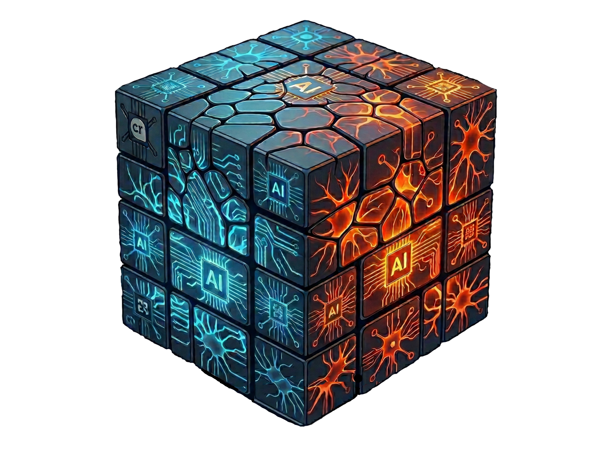

# NeuroBrix

NeuroBrix is an open-source inference engine that runs AI models (language models,
vision-language and omni models, speech recognition, speech synthesis, image and video
generation, and image upscaling) from one container format and one command-line tool.
It is for developers who want to run these models on their own GPUs or CPUs without
writing or maintaining a separate pipeline for each model family. NeuroBrix does not
train models. It runs published models that have been packaged as `.nbx` containers and
distributed through the [NeuroBrix Hub](https://neurobrix.es/models).

<p align="center">
  
</p>

<p align="center">
  <a href="https://pypi.org/project/neurobrix/"></a>
  <a href="https://pypi.org/project/neurobrix/"></a>
  <a href="https://github.com/NeuroBrix/neurobrix/blob/main/LICENSE"></a>
  <a href="https://neurobrix.es/models"></a>
</p>

<p align="center">
  <a href="https://neurobrix.es/models">Hub</a> &nbsp;|&nbsp;
  <a href="https://docs.neurobrix.es">Documentation</a> &nbsp;|&nbsp;
  <a href="https://github.com/NeuroBrix/neurobrix/releases">Releases</a> &nbsp;|&nbsp;
  <a href="https://github.com/NeuroBrix/neurobrix/blob/main/CONTRIBUTING.md">Contributing</a> &nbsp;|&nbsp;
  <a href="https://gitlab.com/neurobrix/neurobrix">GitLab mirror</a>
</p>

---

## What NeuroBrix does

- **One engine and one container format for every family it runs.** A model is shipped as
  a `.nbx` container that holds its computation graph, its weights, the way its components
  connect, and its runtime defaults. The engine reads all of that from the container.
  There is no hand-written pipeline per model: the same runtime executes a mixture-of-experts
  language model, a speech recognizer, a text-to-speech model and a video diffusion model
  through a small set of generic execution flows (autoregressive decoding, iterative
  denoising, encoder-decoder, and others).
- **Two independent compute branches over the same container.** The default branch runs
  the graph through PyTorch (ATen, with cuDNN and cuBLAS on NVIDIA GPUs). The Triton branch
  (`--triton`) runs the same graph through NeuroBrix's own Triton kernels and its own tensor
  type instead of PyTorch's operator library. The branches share the container and the
  placement plan, not compute code, so one can be checked against the other.
- **Placement is computed, not configured.** NeuroBrix detects the machine's devices and
  memory and plans where each component runs: on one GPU, across several GPUs, streamed
  through GPU memory, or offloaded to host memory. `neurobrix run --explain-plan` prints the
  chosen plan and the alternatives it rejected, without loading the model.
- **A request that does not fit is refused with figures.** When the plan cannot hold a
  request on your hardware, NeuroBrix stops with an error that names what was needed and
  what was available, rather than silently degrading the output.

`.nbx` containers are produced from the original published weights by the project's build
toolchain. You do not need that toolchain to run models: `neurobrix import` downloads
ready-made containers from the hub.

---

## Install and first run

NeuroBrix needs Python 3.10 or newer and PyTorch 2.1 or newer. The current release is
**0.5.4** ([release notes](https://github.com/NeuroBrix/neurobrix/releases/tag/v0.5.4)),
which supports **NVIDIA GPUs (CUDA) and CPU**.

Install PyTorch first, from the index that matches your hardware, then NeuroBrix.
`pip install neurobrix` on its own pulls the default PyTorch wheel from PyPI, which may be
built for a CUDA version your driver or GPU cannot use; you would then get an engine that
silently runs on CPU.

**NVIDIA GPU (Linux).** Install the NVIDIA driver, then the PyTorch CUDA build that your
driver supports (see the selector on [pytorch.org](https://pytorch.org/get-started/locally/)):

```bash
pip install torch --index-url https://download.pytorch.org/whl/<cuda-build>   # e.g. cu126
pip install neurobrix
neurobrix doctor
```

**NVIDIA V100 (Volta).** Current CUDA 13 builds of PyTorch no longer support Volta. Use a
`cu126` build. `torch 2.10.0+cu126` and `torch 2.14.0+cu126` were checked on the project's
V100 machines. The default PyPI `torch` and the cu128, cu129, cu130 and cu132 builds were not
usable there.

```bash
pip install torch --index-url https://download.pytorch.org/whl/cu126
pip install neurobrix
neurobrix doctor
```

**CPU only.**

```bash
pip install torch --index-url https://download.pytorch.org/whl/cpu
pip install neurobrix
```

`neurobrix doctor` checks that the `neurobrix` command is on your PATH, which PyTorch build
is installed, and whether PyTorch can see the GPUs your driver reports. It exits non-zero
when it finds a problem that will block a run.

### First run

```bash
# Browse the hub and download a small language model
neurobrix hub --category LLM
neurobrix import TinyLlama/TinyLlama-1.1B-Chat-v1.0

# Run it once (hardware is detected automatically)
neurobrix run --model TinyLlama-1.1B-Chat-v1.0 \
    --prompt "Write a Python function that reverses a string." --max-tokens 256
```

`neurobrix import <org>/<name>` installs the model under `~/.neurobrix/cache/<name>`, and
`--model` takes that `<name>`.

To keep a model loaded between requests, start the serving daemon:

```bash
neurobrix serve --model TinyLlama-1.1B-Chat-v1.0
neurobrix chat                       # interactive multi-turn chat
neurobrix run --prompt "Hello"       # --model can be omitted while a daemon is running
neurobrix stop                       # stop the daemon and free GPU memory
```

---

## Hardware and modality coverage

### Hardware

| Hardware | Status |
|---|---|
| NVIDIA GPUs, Linux (CUDA) | Released in 0.5.4. Both compute branches. The project's own test machines are V100s. |
| CPU (x86-64) | Released in 0.5.4. |
| Apple Silicon (Metal) | **Not in a release.** Triton execution on Apple GPUs (through the Triton AppleGPU backend of `triton-lang/triton-ext`) is being integrated on `main` and is planned for 0.5.5. No install procedure is published for it yet. |
| AMD GPUs (ROCm) | Code paths exist but have never run on AMD hardware. Not supported. |
| Windows | Not tested by the project. |

Several GPUs in one machine are used automatically when a model does not fit on one.
Known limitations of the current release are listed in its
[release notes](https://github.com/NeuroBrix/neurobrix/releases/tag/v0.5.4). Read them before
filing a bug.

### Models on the hub

The hub listed 45 public models in 10 categories on 2026-10-12. The hub itself is the live
list (`neurobrix hub`, or [neurobrix.es/models](https://neurobrix.es/models)). Each
identifier below is what you pass to `neurobrix import`.

| Category | Models |
|---|---|
| Language models (`LLM`) | `TinyLlama/TinyLlama-1.1B-Chat-v1.0`, `ibm-granite/granite-3.1-1b-a400m-instruct`, `deepseek-ai/deepseek-moe-16b-chat`, `Qwen/Qwen3-30B-A3B-Thinking-2507` |
| Code (`CODE`) | `deepseek-ai/DeepSeek-Coder-V2-Lite-Instruct`, `Qwen/Qwen3-Coder-30B-A3B-Instruct` |
| Vision-language (`VLM`) | `zai-org/GLM-4.1V-9B-Thinking` |
| Multimodal (`MULTIMODAL`) | `deepseek-ai/Janus-Pro-7B`, `inclusionAI/Ming-Lite-Omni-1.5`, `openbmb/MiniCPM-o-4_5`, `Qwen/Qwen3-Omni-30B-A3B-Instruct`, `Qwen/Qwen3-VL-30B-A3B-Thinking` |
| Speech-to-text (`STT`) | `openai/whisper-large`, `openai/whisper-large-v3-turbo`, `nvidia/parakeet-tdt-1.1b` |
| Speech understanding (`AUDIO_LLM`) | `mistralai/Voxtral-Mini-3B-2507`, `nvidia/canary-qwen-2.5b`, `ibm-granite/granite-speech-3.3-8b` |
| Text-to-speech (`TTS`) | `hexgrad/Kokoro-82M`, `ResembleAI/chatterbox`, `microsoft/VibeVoice-1.5B`, `canopylabs/orpheus-3b-0.1-ft`, `fishaudio/s1-mini` |
| Image generation (`IMAGE`) | `ostris/Flex.1-alpha`, `PixArt-alpha/PixArt-XL-2-1024-MS` |
| Video generation (`VIDEO`) | `zai-org/CogVideoX-2b`, `zai-org/CogVideoX-5b-I2V`, `genmo/mochi-1-preview`, `hpcai-tech/Open-Sora-v2`, `rhymes-ai/Allegro`, `rhymes-ai/Allegro-TI2V`, `Efficient-Large-Model/SANA-Video_2B_720p_diffusers`, `Wan-AI/Wan2.1-T2V-1.3B-Diffusers`, `Wan-AI/Wan2.1-VACE-1.3B-diffusers`, `Wan-AI/Wan2.1-I2V-14B-480P`, `Wan-AI/Wan2.2-I2V-A14B` |
| Upscaling (`UPSCALER`) | Real-ESRGAN (x2, x4plus, x8), SwinIR (classical x2, x4), Swin2SR (classical x2, x4, real-world x4), HAT-L x4 |

A model being on the hub means its container can be downloaded. It does not mean every model
works on every hardware and in every execution mode; the release notes say which do not.

---

## Usage by family

The family is read from the container, so `run` takes the inputs that family needs. Run
`neurobrix run --help` for every flag.

```bash
# Language model
neurobrix run --model TinyLlama-1.1B-Chat-v1.0 --prompt "Explain recursion." \
    --temperature 0.7 --max-tokens 512 --output answer.txt

# Speech-to-text: audio in, text out
neurobrix run --model whisper-large-v3-turbo --audio recording.wav

# Speech understanding: audio plus an instruction
neurobrix run --model Voxtral-Mini-3B-2507 --audio meeting.wav \
    --prompt "Summarize this call."

# Text-to-speech
neurobrix run --model Kokoro-82M --prompt "Hello from NeuroBrix." --output speech.wav

# Vision-language: image plus a question
neurobrix run --model GLM-4.1V-9B-Thinking --input-image photo.jpg \
    --prompt "What is in this image?"

# Multimodal models take --mode (text or image)
neurobrix run --model Janus-Pro-7B --mode text --input-image photo.jpg --prompt "Describe this image."
neurobrix run --model Janus-Pro-7B --mode image --prompt "a red apple on a wooden table"

# Image generation
neurobrix run --model Flex.1-alpha --prompt "a lighthouse at dusk" \
    --steps 20 --seed 42 --output lighthouse.png

# Video generation; --input-image switches an image-to-video model to its first frame
neurobrix run --model CogVideoX-2b --prompt "a hot air balloon over mountains" \
    --num-frames 17 --seed 42 --output balloon.mp4

# Upscaling
neurobrix upscale --model Real-ESRGAN-RealESRGAN_x4plus --input photo.png --output photo_x4.png
```

### Execution modes

| Flag | Branch | Use |
|---|---|---|
| `--compiled` (default) | PyTorch | Normal use. |
| `--triton` | Triton | The engine's own Triton kernels instead of PyTorch's operator library. |
| `--sequential` | PyTorch, one operation at a time | Debugging. |
| `--triton-sequential` | Triton, one operation at a time | Debugging. |

The same flags apply to `neurobrix serve`. `neurobrix upscale` takes them as
`--mode compiled|sequential|triton|triton-sequential`.

### Managing models

```bash
neurobrix hub [--category CATEGORY] [--search TERM]   # browse the hub
neurobrix import <org>/<name> [--no-keep] [--force]   # download and install
neurobrix list [--store]                              # installed models / downloaded archives
neurobrix remove <name> [--all]                       # remove from the cache (and the store)
neurobrix clean --all -y                              # remove everything
neurobrix info --models --hardware --system           # what is installed and detected
neurobrix inspect <name or model.nbx>                 # look inside a container
neurobrix validate <model.nbx>                        # check a container's integrity
```

Downloaded archives are kept in `~/.neurobrix/store/` and extracted models in
`~/.neurobrix/cache/`. `--no-keep` deletes the archive once it is extracted. Read commands
(`info`, `list`, `hub`, `inspect`, `doctor`, `run --explain-plan`) accept `--json` for
scripting.

---

## The `.nbx` container

A container is a directory archive with a manifest, a topology describing how components
connect, runtime defaults, and one directory per component (text encoder, transformer, VAE,
language-model head, and so on), each with its computation graph and its weights in
safetensors format. Tokenizers and other non-neural modules travel in the same archive.
The format is described in [docs/architecture/nbx-format.md](./docs/architecture/nbx-format.md).

---

## Contributing

Bug reports, model requests, hardware reports and code are welcome. Read
[CONTRIBUTING.md](./CONTRIBUTING.md) first; it covers the development setup, the engine's
design rules (no hard-coded model values, no silent fallbacks, no model-specific logic in the
runtime) and the review process. Security issues follow [SECURITY.md](./SECURITY.md) and are
not filed as public issues.

- Issues and pull requests: [GitHub](https://github.com/NeuroBrix/neurobrix/issues), mirrored on
  [GitLab](https://gitlab.com/neurobrix/neurobrix)
- Model hub: [neurobrix.es/models](https://neurobrix.es/models)
- Documentation: [docs.neurobrix.es](https://docs.neurobrix.es) and the [docs/](./docs) directory
- Roadmap: [docs/roadmap.md](./docs/roadmap.md)
- Changes: [CHANGELOG.md](./CHANGELOG.md)

---

## Model licenses

NeuroBrix runs models; it does not create, train or own them. Every model on the hub is the
work of its authors and stays under its original license, which the hub shows and which
`neurobrix import` asks you to accept. Some are restricted: for example `fishaudio/s1-mini`
is licensed CC-BY-NC-SA-4.0 (non-commercial use only). You are responsible for using each
model within its license. The hub's packages contain the original published weights
repackaged in the `.nbx` format. If you are a model author and believe a package does not
respect your license, open an issue on this repository.

## License

The NeuroBrix engine, CLI, runtime and container tooling are released under the
[Apache License 2.0](./LICENSE). The license does not cover model weights.

Copyright 2025-2026 Hocine Benkelaya. Managed by [WizWorks OÜ](https://wizworks.io/), a
property of [NEURAL NETWORK HOLDING LTD](https://neuralnetworkholding.com/).
