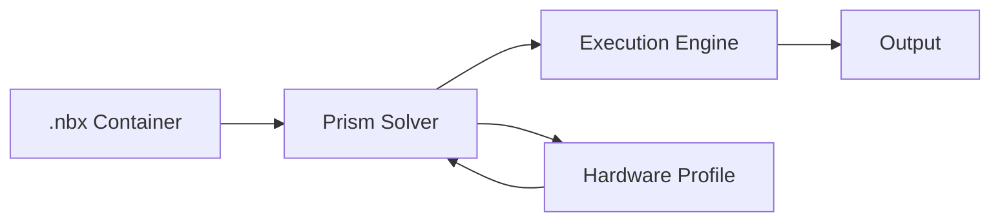

# Architecture

Technical deep-dives into how NeuroBrix works.

## Overview

NeuroBrix has three layers:

1. **NBX Container** — Self-contained model archive (graph, weights, topology)
2. **Prism Solver** — Automatic hardware allocation and strategy selection
3. **Execution Engine** — Graph runtime with CompiledSequence for zero-overhead execution

## Topics

- **[Runtime Engine](runtime.md)** — CompiledSequence, DtypeEngine, memory management
- **[NBX Format](nbx-format.md)** — The universal model container
- **[ZERO Principles](zero-principles.md)** — Core design philosophy
